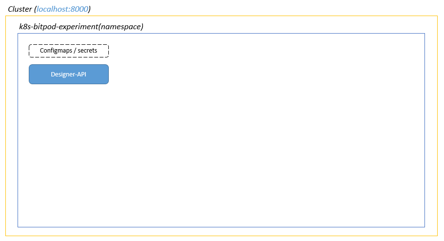

## Prereqs:

- Have a kubernetes cluster available

- Have kubectl configured to the cluster

    - suppose cluster is configured and  available on localhost:8000 

## Install:

1. yarn/npm install bitpod-cli -g

2. bitpod-cli create --namespace=k8s-bitpod-experiment --version="latest"

    - At this point your namespace didn't contain any service.
    
       
## Setup (see implementation):

- The script asks "some" questions and based on that creates and runs the right kubectl commands:

- It seeds the neccessary configmaps/secrets in the namespace.

- It then creates a new statefulset/deployment for the docker image of the "latest" bitpod designer pod.

 

## First-run/Initialization:

- Designer detects a "first-start", basically checks if there's a persistent disk which has past run logs.

- Designer provisions the helper services based on its metadata (code) instructions.

- Designer setups these things:

  - Redis

  - Mongodb (designer-db)

  - Routing (nginx)

  - Webhosting

    - Designer UI (how would we setup a docker image here!!?)

  - Updates secrets/configmaps as neccessary.

  - Loopback instances

    - Dev

    - Prod

-----------------------------

## Accessing Designer:

- The setup script then exposes the designer-ui service locally and launches it in a browser.

 

## Setting up Designer:

- User management

  - Add more users into various roles like $dbdev, $webdev, $admin, $relops.

  - Access Keys Management.

- Env Mgmt

  - Add/Manage/Delete environments

  - Provision data instances

  - Map data instances to environment

  - See stats of the data instances

    - How much space is consumed etc.

- "Data" management

  - Models

  - Relations

  - Events

  - ACLs

  - Workflows

 - Sites management

- Security

  - Roles

  - Users

- Release Management

  - Create release sets - versioned collection of models, roles, relations, events to be packaged in a release.

  - Docker repo settings:

   - Setup private repo credentials.

  - Create release (docker) images from the release sets.

  - Deploy an image into a specific "live" environment.

- Workflow Mgmt?

- Routes Mgmt